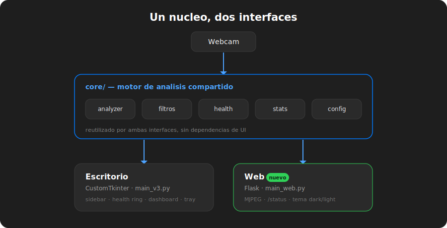

# Spine Guard

> Monitor de postura en tiempo real con webcam. Te avisa cuando te encorvas — disponible como **app de escritorio** y como **app web**.

<p align="center">
  
  
  
  
  
</p>

Spine Guard usa vision por computadora (**MediaPipe Pose**) para analizar tu postura cuadro a cuadro mientras trabajas frente a la computadora. Hace una breve calibracion para aprender tu postura ideal y, a partir de ahi, detecta en vivo si te inclinas hacia adelante, te encorvas o ladeas la cabeza, avisandote para que corrijas antes de que se vuelva un dolor de espalda.

La logica de analisis vive en un **nucleo compartido** (`core/`) sin dependencias de interfaz, lo que permite ofrecer **dos frentes sobre el mismo motor**: una app de escritorio y una app web.

<p align="center">
  
</p>

## Dos interfaces

|  | Escritorio | Web |
|---|---|---|
| **Entry point** | `python main_v3.py` | `python main_web.py` |
| **Framework** | CustomTkinter (estilo macOS) | Flask + HTML/CSS/JS |
| **Donde se ve** | Ventana nativa | Navegador (`http://localhost:5000`) |
| **Video** | Widget nativo | Streaming MJPEG |
| **Extras** | System tray, alertas sonoras | Tema dark/light, multiplataforma |

Ambas comparten el mismo `core/`: si mejora la deteccion de postura, mejora en las dos a la vez.

## Caracteristicas

- **Deteccion de postura en tiempo real** con MediaPipe Pose, rastreando puntos clave del cuerpo (hombros, cabeza, torso).
- **Calibracion automatica**: al iniciar, el sistema aprende tu postura ideal en unos segundos.
- **Deteccion de multiples problemas**: cabeza adelantada, encorvamiento (cabeza baja y hombros adelante), hombros tensos, cabeza inclinada e inclinacion lateral.
- **Barra de salud**: indicador que baja cuando mantenes mala postura y se recupera al corregirla, estilo videojuego.
- **Alertas escalables**: avisos que se intensifican segun la gravedad y duracion del problema.
- **Recordatorios de descanso**: aviso configurable para levantarte y estirar cada cierto tiempo.
- **Estadisticas de sesion**: porcentaje de buena postura, tiempo de uso, alertas emitidas y problemas mas frecuentes.
- **Historial en CSV**: exporta los datos de cada sesion para revisar tu progreso.
- **Tema claro/oscuro** en ambas interfaces.

## Como funciona

1. **Calibracion** — promedia ~90 frames de tu postura sentada para fijar una referencia personal (baseline).
2. **Metricas por frame** — a partir de los landmarks de MediaPipe calcula senales como inclinacion frontal, profundidad de la cabeza, caida de cabeza, ancho/elevacion de hombros, angulo de la cabeza y desplazamiento lateral.
3. **Suavizado** — un *1-Euro Filter* reduce el temblor de los landmarks para que las metricas sean estables.
4. **Evaluacion con histeresis** — compara cada metrica contra tu baseline con umbrales que evitan el parpadeo entre "buena/mala", y reajusta lentamente la referencia mientras tu postura es buena.
5. **Salud y alertas** — la barra de salud sube con buena postura y baja con la mala; tras varios frames malos seguidos se dispara una alerta (sonora en escritorio, visual en ambas).

## Stack tecnico

| Componente | Tecnologia |
|---|---|
| Lenguaje | Python 3.10+ |
| Vision | OpenCV + MediaPipe Pose Landmarker |
| Filtrado | 1-Euro Filter (suavizado de landmarks) |
| UI escritorio | CustomTkinter (interfaz estilo macOS) |
| UI web | Flask + HTML/CSS/JS, video por MJPEG |
| Graficos | Matplotlib (embebido en el dashboard) |
| Notificaciones | plyer + winsound (escritorio) |
| System tray | pystray + Pillow |

## Instalacion

```bash
# Clonar el repo
git clone https://github.com/JuanBonadeo/Spine-Guard.git
cd Spine-Guard

# Crear entorno virtual (recomendado)
python -m venv venv
venv\Scripts\activate        # Windows
# source venv/bin/activate   # macOS / Linux

# Instalar dependencias
pip install -r requirements.txt
```

> Necesitas el modelo `pose_landmarker_lite.task` de MediaPipe en la raiz del proyecto (no se versiona por su tamano).

## Uso

### App de escritorio

```bash
python main_v3.py
```

1. La app abre la webcam y te pide que te sientes derecho para calibrar.
2. Una vez calibrada, comienza el monitoreo en tiempo real.
3. Navega entre las vistas desde la barra lateral: **Monitor**, **Dashboard**, **Ajustes** e **Historial**.

#### Atajos de teclado

| Atajo | Accion |
|---|---|
| `Ctrl+1/2/3/4` | Cambiar entre vistas |
| `Ctrl+P` | Pausar / reanudar |
| `Ctrl+C` | Recalibrar postura |
| `Ctrl+B` | Registrar break manual |
| `Ctrl+T` | Alternar tema claro/oscuro |
| `Ctrl+Q` | Salir |

### App web

```bash
python main_web.py
```

Abri **http://localhost:5000** en el navegador. Calibra (sentate derecho unos segundos) y arranca el monitoreo: video con landmarks, anillo de salud, metricas en vivo y botones de **Pausar** / **Calibrar**, con toggle de tema claro/oscuro.

> Corre el escritorio **o** la web, no ambos a la vez: comparten la misma webcam.

## Estructura del proyecto

```
Spine-Guard/
├── main_v3.py              # Entry point ESCRITORIO (CustomTkinter)
├── main_web.py             # Entry point WEB (Flask)
├── app.py                  # App de escritorio (coordinador)
│
├── core/                   # Motor de analisis — COMPARTIDO
│   ├── analyzer.py         # Deteccion de postura con MediaPipe
│   ├── capture.py          # Captura de webcam
│   ├── filters.py          # 1-Euro Filter (suavizado)
│   ├── health_bar.py       # Barra de salud
│   ├── notifier.py         # Alertas sonoras (escritorio)
│   └── session_stats.py    # Estadisticas de sesion
│
├── config/                 # Configuracion — COMPARTIDA
│   ├── defaults.py         # Valores por defecto
│   └── settings.py         # Persistencia (JSON)
│
├── ui/                     # Interfaz de ESCRITORIO (CustomTkinter)
│   ├── theme.py            # Tema claro/oscuro
│   ├── sidebar.py          # Barra lateral de navegacion
│   ├── components/         # health_ring, metric_badge, toast, ...
│   └── views/              # monitor, dashboard, settings, history
│
├── web/                    # Interfaz WEB (Flask)
│   ├── engine.py           # PostureEngine — envuelve core/
│   ├── server.py           # Rutas Flask + captura de camara
│   ├── templates/          # base.html, index.html, partials/
│   └── static/             # css/ (tokens, base, monitor) + js/
│
├── tray.py                 # Icono en bandeja del sistema (escritorio)
├── requirements.txt
└── docs/                   # Documentacion de diseno (SDD) + diagramas
```

> `main.py` (raiz) es el entry point legacy de la v2 con UI basada en OpenCV.

## Documentacion de diseno

El directorio [`docs/`](docs/) contiene los **Software Design Documents** del proyecto:

- `SDD_PostureChecker_v3.md` — diseno de la interfaz de escritorio (CustomTkinter, estilo macOS).
- `SDD_PostureChecker_Web.md` — diseno de la interfaz web, con paridad visual respecto al escritorio.

## Contexto academico

Proyecto desarrollado para la materia **Soporte a la Gestion de Datos con Programacion Visual** de la [UTN (Universidad Tecnologica Nacional)](https://www.utn.edu.ar/).
